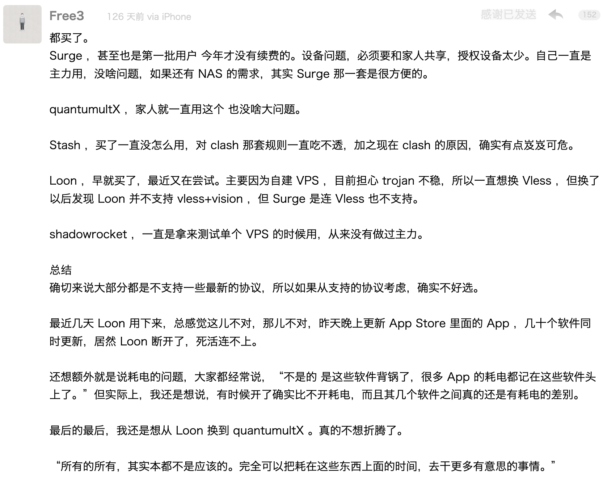

# GFW

简单易用的配置资源

> _所有的所有，其实本都不是应该的。完全可以把耗在这些东西上面的时间，去干更多有意思的事情。_



## 策略组

按地区划分，选择or测速
```
美国节点  US|USA|America|america|United States|美国|凤凰城|洛杉矶|西雅图|芝加哥|纽约|沪美|美 
香港节点  HK|Hong|hong|香港|深港|沪港|京港|港
台湾节点  TW|Taiwan|taiwan|台湾|台北|台中|新北|彰化
日本节点  JP|Japan|japan|Tokyo|tokyo|日本|东京|大阪|京日|苏日|沪日|上日|川日|深日|广日
狮城节点  SG|Sing|sing|新加坡|狮城|沪新|京新|深新|杭新|广新
韩国节点  KR|Korea|korea|KOR|韩国|首尔|韩|韓|春川

# 嵌套
港台大陆  选择       DIRECT 香港 台湾
全球加速  选择或测速  全部节点
直连全球  选择       DIRECT 全球加速
```

*永远直连、代理节点、永远拦截、漏网之鱼：有点多余，可用direct、reject、proxy等代替。*

除了ChatGPT，目前还未有按服务区分的策略组如「苹果服务」、「油管视频」、「电报消息」等

## Quantumult X

[Quantumultx重写](https://whatshub.top/quantumultx)

https://raw.githubusercontent.com/fmz200/wool_scripts/main/QuantumultX/rewrite/chongxie.txt

[Fanminming][fmm]: [conf](example/Qx_fmm.conf), 27c55e3

[墨魚懒人配置][ddgksf2013]：[conf](example/Qx-ddgksf2013.conf), e2a5612

* [Quantumult X 不完全教程](https://www.notion.so/Quantumult-X-1d32ddc6e61c4892ad2ec5ea47f00917)
* [Rules-For-Quantumult-X](https://github.com/sve1r/Rules-For-Quantumult-X)
* [Qx Wiki](https://qx.atlucky.me/)

## Loon

[Fanminming][fmm]：[conf](example/Loon-fmm.conf), 
22a1871

* [LoonExampleConfig](https://github.com/Loon0x00/LoonExampleConfig)
* [Loon 不完全教程](https://www.notion.so/Loon-f0a98c39f5224c09b281c79837380431)

[Loon Plugin Priority](https://github.com/chiupam/tutorial/blob/master/Loon/Plus/Plugin_Summary.md): 
Plugin in essence is just a mini conf, but it's not recommended to put scripts
such as auto sign-in there as it's not possible to change `cron` settings。

## Shadowrocket

[懒人配置][ss_lazy]：[conf](example/SS-wlxuf.conf), e1ce87a

* [Shadowrocket小火箭分流教程|懒人配置](//www.wymoe.com/2022/08/21/Shadowrocket%E5%B0%8F%E7%81%AB%E7%AE%AD%E5%88%86%E6%B5%81%E6%95%99%E7%A8%8B/)
* [小火箭规则 模块化](//github.com/GMOogway/shadowrocket-rules)
* [懒人Shadowrocket配置](https://github.com/Johnshall/Shadowrocket-ADBlock-Rules-Forever)

## 分流

！目前苹果全部**直连**，较为复杂，请参考[分流](Filter.md)

链接格式：`https://raw.githubusercontent.com/blackmatrix7/ios_rule_script/master/rule/软件/类别/类别.list`

软件：AdGuard, Clash, Loon, QuantumultX, Shadowrocket, Surge

| 类别               |   策略   |
|:-------------------|:--------:|
| Advertising        |  REJECT  |
| Advertising_Domain |  REJECT  |
| China              |  DIRECT  |
| China_Domain       |  DIRECT  |
| Apple              | 直连全球 |
| TikTok             | 美国节点 |
| OpenAI             | 美国节点 |
| BiliBili           | 港台大陆 |
| YouTube            | 全球加速 |
| Global             | 全球加速 |
| Global_Domain      | 全球加速 |
| Lan                |  DIRECT  |
| GEOIPCN            |  DIRECT  |
| FINAL              |  PROXY   |


## 广告屏蔽

* [Hackl0us/关于广告屏蔽](https://github.com/Hackl0us/SS-Rule-Snippet#%E5%85%B3%E4%BA%8E%E5%B9%BF%E5%91%8A%E5%B1%8F%E8%94%BD)
* [Chinese specify ad list for AdGuard](https://anti-ad.net/)
* [A more functional blocklist (functionality over blocking)](https://oisd.nl/)
* [AdGuard and Clash X Pro working together](https://www.v2ex.com/t/787455)
* [AdGuard and Clash on Android](https://blog.ichr.me/post/adguard-with-clash/)

* [ios_rule_script](https://github.com/blackmatrix7/ios_rule_scrip)

## 重写

TBC，目前只在Qx试过

```
[rewrite_local]

# VVebo修复用户时间线@suiyuran
# https://github.com/bin64/Scripts/blob/main/QuantumultX/vvebo.js
^https:\/\/api\.weibo\.cn\/2\/users\/show\? url script-request-header https://raw.githubusercontent.com/bin64/Scripts/main/QuantumultX/vvebo.js
^https:\/\/api\.weibo\.cn\/2\/statuses\/user_timeline\? url script-request-header https://raw.githubusercontent.com/bin64/Scripts/main/QuantumultX/vvebo.js
^https:\/\/api\.weibo\.cn\/2\/statuses\/user_timeline\? url script-response-body https://raw.githubusercontent.com/bin64/Scripts/main/QuantumultX/vvebo.js

# 12306去广告@ddgksf2013
# https://raw.githubusercontent.com/ddgksf2013/Scripts/master/12306.js
^https?:\/\/ad\.12306\.cn\/ad\/ser\/getAdList url script-analyze-echo-response https://github.com/ddgksf2013/Scripts/raw/master/12306.js


[rewrite_remote]

# ======= 功能优化 ======= #
https://github.com/ddgksf2013/Rewrite/raw/master/Html/Q-Search.conf, tag=Safari超级搜索@ddgksf2013, update-interval=86400,  opt-parser=false, enabled=true 
https://github.com/ddgksf2013/Rewrite/raw/master/Function/UnblockURLinWeChat.conf, tag=微信解锁被屏蔽的URL@zZPiglet, update-interval=86400, opt-parser=false, enabled=true 

# ======= 广告净化 ======= #
https://github.com/app2smile/rules/raw/master/module/qidian.conf, tag=起点去广告[卸载重装]@app2smile, update-interval=86400, opt-parser=false, enabled=true
https://github.com/ddgksf2013/Rewrite/raw/master/AdBlock/Applet.conf, tag=微信小程序去广告@ddgksf2013, update-interval=86400, opt-parser=false, enabled=true 
https://github.com/ddgksf2013/Rewrite/raw/master/AdBlock/StartUp.conf, tag=墨鱼去开屏2.0@ddgksf2013, update-interval=86400, opt-parser=false, enabled=true 
https://github.com/ddgksf2013/Rewrite/raw/master/AdBlock/Weibo.conf, tag=微博去广告@ddgksf2013, update-interval=86400, opt-parser=false, enabled=true 
https://github.com/ddgksf2013/Rewrite/raw/master/AdBlock/XiaoHongShu.conf, tag=小红书净化+去水印@ddgksf2013, update-interval=86400, opt-parser=false, enabled=true 
https://github.com/DivineEngine/Profiles/raw/master/Quantumult/Rewrite/General.conf, tag=神机重定向@DivineEngine, update-interval=86400, opt-parser=false, enabled=true 
https://github.com/ddgksf2013/Rewrite/raw/master/AdBlock/Bilibili.conf, tag=哔哩哔哩广告净化@ddgksf2013, update-interval=86400, opt-parser=false, enabled=true 
https://github.com/blackmatrix7/ios_rule_script/raw/master/script/zheye/zheye.snippet, tag=知乎去广告及体验增强@blackmatrix7, update-interval=86400, opt-parser=false, enabled=false
https://github.com/app2smile/rules/raw/master/module/tieba-qx.conf, tag=百度贴吧去广告@app2smile, update-interval=86400, opt-parser=false, enabled=false
https://github.com/ddgksf2013/Rewrite/raw/master/AdBlock/Amap.conf, tag=高德地图净化[卸载重装]@ddgksf2013, update-interval=86400, opt-parser=false, enabled=false
https://github.com/ddgksf2013/Rewrite/raw/master/AdBlock/Netease.conf, tag=网易云去广告@ddgksf2013, update-interval=86400, opt-parser=false, enabled=false
https://github.com/Orz-3/QuantumultX/raw/master/JD_TB_price.conf, tag=比价脚本@Orz-3, update-interval=86400, opt-parser=false, enabled=false

```

## 脚本/task/script

```
# > 流媒体解锁查询
event-interaction https://raw.githubusercontent.com/KOP-XIAO/QuantumultX/master/Scripts/streaming-ui-check.js, tag=流媒体解锁查询, img-url=arrowtriangle.right.square.system, enabled=true
```

<!-- ref -->
[fmm]: https://travis-ci.org/travis-ci/travis-web
[ddgksf2013]: https://github.com/ddgksf2013/
[ss_lazy]: https://github.com/wlxuf/Shadowrocket/
